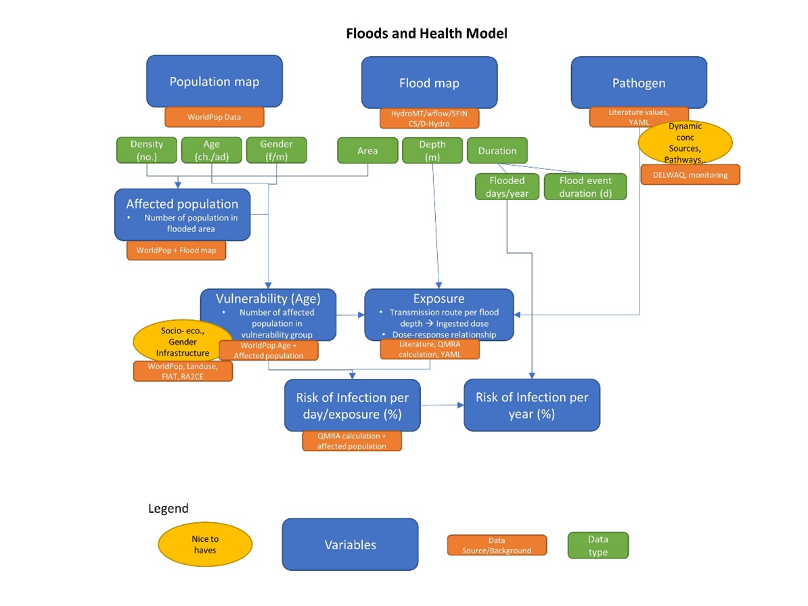
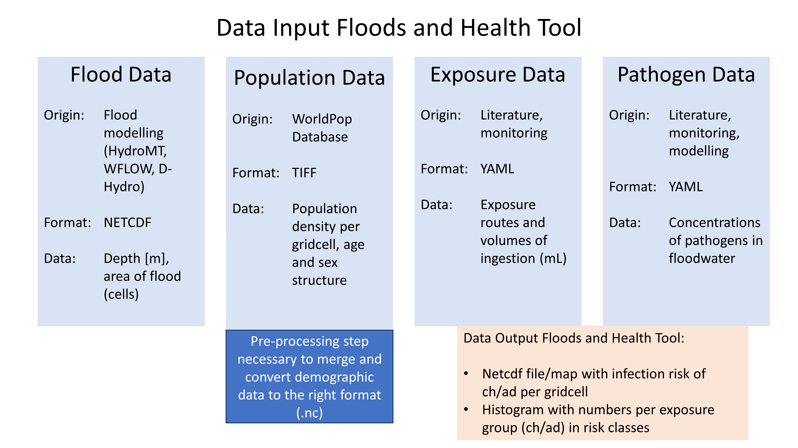
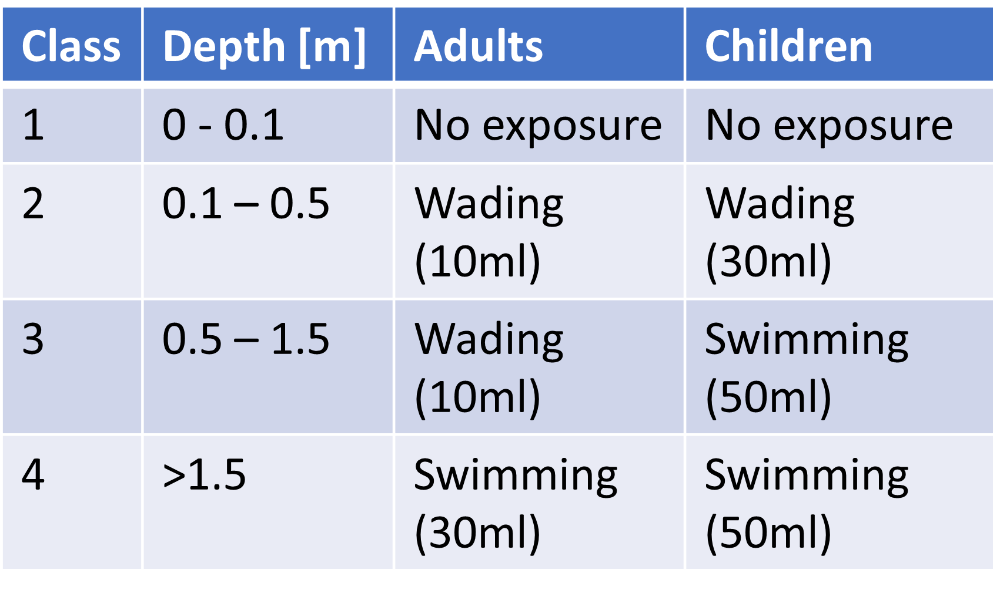
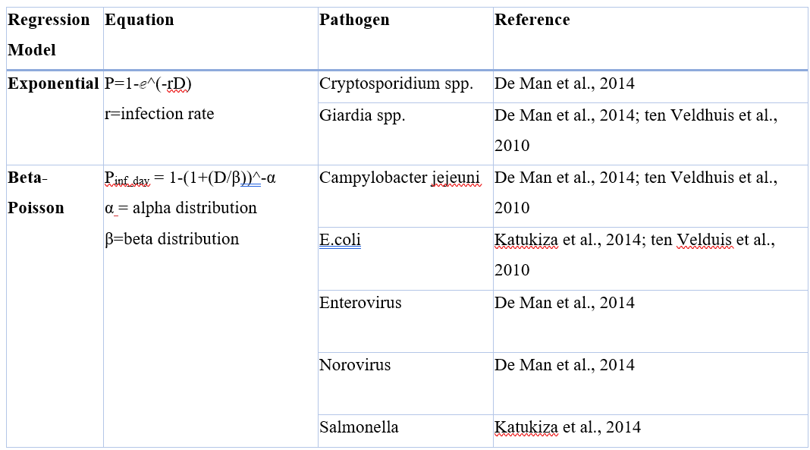

User manual - Step by Step
=====

The Floods and Health tool uses flood maps produced by SFINCS and WFLOW as part of the HydroMT package and transforms it into the requested format for the health assessment (.netcdf).
The input data includes the severity (depth, area), as well as demographic information about the affected population (age, social status, sex). 
Additionally, concentrations of different pathogens in floodwater (E.coli, V. cholerae, Cryptosporidium) and exposure scenario’s of adults and children are provided in two separate YAML files. 
These files can be configurated to adjust the pathogen concentrations or ingested volumes per exposure group. 

For more information regarding specific parameters see the pages 'Input parameters' or 'Output parameters'.

   Overview of the data stream with input data, source and type, as well as potential nice-to-haves.

Pre-processing
---------------

Flood Data
^^^^^^^^^^^^^^
To pre-process the flood data, user defined settings can be adjusted to adjust the origin, coordinates for the bounding box and statistics of the flood map.

.. code-block:: text

	#### User defined settings ####

	# set scenario name
	Fname = 'Scenario_1' 

	# select origin of flood map -> 1 = selected
	Dhydro = 0
	Sfincs = 1

	# set location of the original flood map
	mapsDir = '../examples/'           # location of the original flood map
	nameFM = 'sfincs_beira_map.nc'     # name of the original flood map

	# set bounding box
	BB = 1 # 1 = bounding box, 0 = full map

	if BB == 1:
   	 # set bounding box coordinates
    	xmin = 0.66e6
   	 xmax = 0.71e6
    	ymin = 7.79e6
    	ymax = 7.84e6
  
	# Set the required flood map stats for QMRA analysis 
	FloodArea = 1
	FloodMax  = 0
	FloodDur  = 0
	FloodNr   = 0

	# if FloodArea = 1, choose the timestep, other options create a one time step output
	timestep = 10

Demographic data
^^^^^^^^^^

To use the population density data and age data from the WorldPop Database, the data needs to be merged and the population density data reprojected. Further, they are converted to netcdf format.

.. code-block:: text
	Preparation Steps for the Script: 
	
	1. Download Age Data of the country of interest from https://hub.worldpop.org/geodata/listing?id=88 
	2. Make two different folders for Children (0-10 years) and Adults (>10 years)
	3. Download the Population density map of the country of interest from https://hub.worldpop.org/geodata/listing?id=76 
	
	There should be two input folders (1. adults and 2. children) containing the different tif files of adult and children population and one single file 		with the overall population density. All files are in TIF format and will be converted to NETCDF ultimately.

Grid characteristics
-----------------
   
.. code-block:: text
	
	
	
	projection      = EPSG:4326 - WGS 84
	y0              = 	
	mmax            = 
	nmax            = 
	dx              = 
	dy              = 
	rotation        = 
	
	
Input format 
^^^^^

.. code-block:: text

	inputformat = net

Output format
^^^^^

The main map output is in netcdf.

.. code-block:: text

	outputformat = net

Output files 
^^^^^

In case of netcdf output the map output will be named '', in case observation points are provided also a second file will be created with observation point output named ''.

For more information about the variables saved to the netcdf output files, see the 'Output description' section.

.. code-block:: text

QMRA parameters
-------------

The user needs to define the desired pathogen, source, conc, dose-response relationship and values for the equation as indicated below.

.. code-block:: text

	# User defined settings for pathogen and scenario selection

	pathogen = 'E.coli' # select the pathogen for the simulation. Option at the moment is only 'E.coli'
	source = 'Sewer_and_pluvial' #select the source of the pathogen. At the moment only 'Sewer_and_pluvial'
	conc = 'max' #select the concentration of the pathogen: options are 'min' and 'max'
	doseresp = 'poisson' #select the dose response curve of the pathogen for infection calculation. Either 'beta poisson' (keyword: 'poisson') or exponantial 	('exp', not yet included)

	#form values for poisson distribution
	N50 = 896 #constant for the beta poisson infection risk calculation
	NoE  = 4  #number of events per year 
	alpha = 0.145 #form value for poisson distribution

Pathogen concentration
^^^^^^^^^^^^^^^^^^

Pathogen concentration as default in YML file for different scenario's based on literature values.

.. code-block:: text

	pathogens:
  	- name: E.coli
	scenarios:
      	- name: Scenario 1
        min_conc: 1000
        max_conc: 100000
        source: Sewer_and_pluvial
        units: MPN/ml
     	- name: Scenario 2
        min_conc: 0
        max_conc: 1840
        source: Fluvial_and_sewerinflow
        units: MPN/ml
      	- name: Scenario 3
        min_conc: 870
        max_conc: 1080000
        source: Sewer
        units: CFU/ml

	- name: Campylobacter
    	scenarios:
      	- name: Scenario 1
        min_conc: 0.014
        max_conc: 1
        source: Sewer
        units: MPN/ml
      	- name: Scenario 2
        min_conc: 23
        max_conc: 240
        source: Sewer
        units: CFU/ml

  	- name: Enterococci
   	scenarios:
      	- name: Scenario 1
        min_conc: 100000
        max_conc: 1000000
        source: Sewer_and_pluvial
        units: CFU/ml
      	- name: Scenario 2
        min_conc: 5000
        max_conc: 37000
        source: Sewer
        units: CFU/ml

  	- name: Cryptosporidium
    	scenarios:
      	- name: Scenario 1
        min_conc: 10
        max_conc: 15
        source: Sewer
        units: oocysts/L
      	- name: Scenario 2
        min_conc: 0.1
        max_conc: 10
        source: Sewer
        units: oocysts/L

  	- name: Giardia
    	scenarios:
      	- name: Scenario 1
        min_conc: 0.1
        max_conc: 10000
        source: Sewer
        units: oocysts/L

Exposure Scenario's 
^^^^^^^^^^^^^^^^^^^^^^^^^^^^^^
Exposure scenario's and ingested volumes are based on the flood depth and age of the population.

The default values for the ingested volumes are default values in a YML file based on literature.

.. code-block:: text

	-Splashed_Adult: 
  	unit: ml/event
  	conc: 10
	
	-Wading_Adult:
 	unit: ml/event
  	conc: 10
	
	-Swimming_Adult: 
 	unit: ml/h
  	conc: 3.5
	
	-Playing_Children:  
 	unit: ml/d
  	conc: 30

	-Swimming_Children: 
	unit: ml/h
  	conc: 50
	

Dose-Response-Relationship 
^^^^^^^^^^^^^^^^^^^^^^^^

Based on the specific pathogen, the user needs to choose the calculation method and the necessary parameter from literature

	

