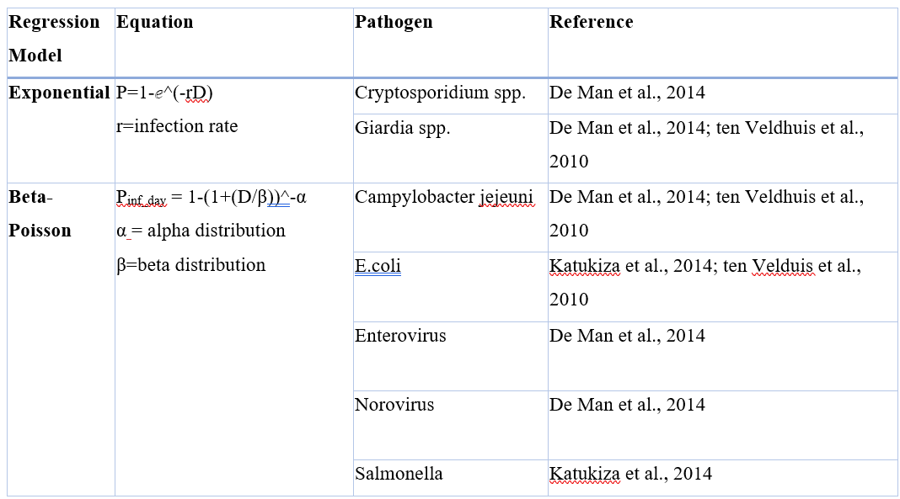
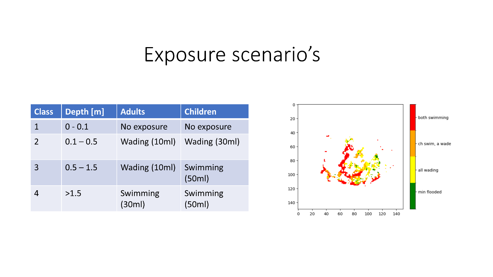

Introduction
=======

Introduction to The Floods and Health Tool¶
----------------------

What is The Floods and Health Tool?¶
^^^^^

The Floods and Health tool is capable of simulating the infection risk of specific waterborne diseases in a population that is exposed to floodings. 
It performs spatial analysis of floods and population density data in order to identify areas and exposure groups (children/adults) that are at risk of infection through pathogens in the floodwater. 
The aim of the tool is to show the distribution of the population in areas affected by floods, and how different flood levels are likely to affect the risk of infection with a given pathogen for different exposure groups. 
The infection risk and burden of disease are calculated using a Quantitative microbial risk assessment (QMRA) approach. 

   

Why the Floods and Health Tool?¶
^^^^^
Floods can have significant effects on public health, which include direct injuries, destructed health infrastructures, mental health issues and the spread of water or vector-borne diseases. 
These consequences on human well-being can be assessed by incorporating health impacts into flood modelling to allow a comprehensive risk assessment by understanding potential hazards, vulnerabilities and exposures. 
This can be done by identifying high risk areas and exposure groups, as well as response strategies and interventions to reduce the risk of infection and disease transmission.

The Floods and Health Tool aims to map out the flooded population and available vulnerability factors (age, sex) to identify risk areas during the flooding. 
By using the Quantitative Microbial Risk Assessment (QMRA) approach, the tool forecasts the infection risk for persons affected by flooding for specific pathogens responsible for the outbreak of water-borne diseases.

We have two goals:

1. We would like to use this Flood and Health Tool in the future to forecast flood risk management scenarios, e.g., probabilistic flood map. 
The model can be used to determine the relative change in infection risk and disease transmission in flood risk management scenarios in different regions 
to communicate risks and propose intervention measures to policymakers and the public (“Flood scenario setting”). 

2. We would like to predict the area and amount of people that are at risk to determine where medication is needed, which areas need medical care (now cast). 
The model can be used to determine the number of persons that potentially will get ill in case of a flood disaster. (“Nowcast in case of disaster”). 

What's behind the Floods and Health Tool? 
-----

Coastal model
^^^^^

The tool uses the flood maps produced by SFINCS and WFLOW as part of the HydroMT package and transforms it into the requested format for the health assessment.

Ideally, the input data includes the severity (depth, area) and duration of the flood, 
as well as demographic information about the affected population (age, social status, pre-existing health conditions) and critical (health) infrastructure.

.. figure:: ./figures/Data Stream Floods and Health.jpg
   :width: 600px
   :align: center

   Floods and Health Tool workflow.
   

At the current state, the model:
1. Combines the flood maps with population density data to identify the number of people affected by the flood.

2. Uses the age distribution of the population to identify the number of children and adults affected by the flood.

3. Uses the flood depth to identify exposure groups (children/adults) that are at risk of waterborne disease transmission due to flooding.

4. Uses a fixed concentration of pathogens (E.coli) in the floodwater to calculate the infection risk for the exposure groups with the QMRA approach.

5. Visualizes the infection risk per exposure group (adult, children) in a map and bar chart with infection risk groups.

QMRA (Quantitative Microbial Risk Assessment)?¶
======================
QMRA (Quantitative Microbial Risk Assessment) models are often used to estimate the risk of disease transmission through the consumption of contaminated food or water. 
It is a risk assessment tool that estimates the risk of disease transmission from exposure to a specific dose of pathogens. 
In the context of food and water, QMRA can be used to estimate the number of people who will become ill after consuming a contaminated food or water product (Haas et al., 2014). 
QMRA can be used to estimate the number of people who will become ill (Daniels et al., 2018). 

Calculation steps 
-----
A Quantitative Microbial Risk Assessment (QMRA) typically involves several parameters that are used to estimate the risk of infection from exposure to microorganisms 
in water or food. The four key steps and parameters are explained below. 

1.	Hazard – Pathogen concentrations (CPathogen_floodwater)
----
This parameter represents the target pathogen and its concentration of the microorganism in the water or food source. 
It is typically estimated using laboratory analysis of water or food samples.
Alternatively, concentrations of pathogens can be derived from modeling outputs (e.g., DeWAQ) or the literature (e.g., from Addison-Atkinson et al., 2022).  

2.	Exposure Assessment 
----
The exposure assessment includes factors such as the pathway, frequency and duration of exposure as well as the susceptibility/vulnerability of the population. 
There are many ways to assess the exposure, e.g., by modelling, interviews with the inhabitants or based on previous research (Eregno, 2016; Mark et al., 2018; Katukiza et al., 2014). 

Volume of ingestion (Vtotal_ingested)
^^^^^^^^^^
The calculations of the Volume of Exposure (V total ) can consist of several parameters such as the route of exposure (ingestion, inhalation, dermal), 
amount of exposure (e.g., drinking, swimming), frequency and duration of exposure and host susceptibility (e.g., children, adults). 

Routes of exposure: 
^^^^^^^^^^
This parameter represents the different pathways by which an individual can be exposed to the microorganism, such as ingestion, inhalation, or skin contact.  

There are several sources:   
1) drinking water from a well that is flooded and got contaminated. Data on the Volumes of ingested drinking water can vary between 1 to 3 L/day (US EPA, 2011).   

2) by playing/swimming in the flood water. There are studies about the volume intake during swimming depending on age (Schets et al., 2011, US EPA, 2011) and children playing in the floodwater (Steyn et al., 2004).  

3) via hand-mouth contact. This occurs when people are wading in the floodwaters or touch wet objects in their flooded house and bring the wet hand to their mouth. This could also occur during cleaning up after a flood. Data on hand-mouth contact with floodwater is described in a study by De Man et al., 2014. 

4)Ingestion of contaminated food. This occurs when a product is washed in contaminated water, or when the product grew on lands that were flooded and were not washed properly. 
Exposure duration: this parameter represents the length of time that an individual is exposed to the microorganism. This data can be derived from questionnaires answered by the local population or in literature (Mark et al., 2014).

Exposure frequency: 
^^^^^^^^^^
This parameter represents the number of times that an individual is exposed to the microorganism over a given period of time. Literature values can be found in the study of Freeman et al., 2001. 

Host susceptibility: 
^^^^^^^^^^
This parameter represents the individual's susceptibility to infection, taking into account factors such as age, underlying health conditions, and immune status. This data is derived as part of the vulnerability assessment and is based on the demographic data input or already included in the exposure measurements (e.g., ingestion volume of water through children or adults). 

Dose (D)
^^^^^^^^^^
The Dose describes the amounts of pathogens that are consumed by the host. It is calculated by combining the total Volume of exposure with the concentration of the pathogen (Hazard) in the flood water.  

D = Vtotal_ingested*CPathogen_floodwater

3.	Dose-Response relationships 
^^^^^^^^^^
This parameter relates the dose of the microorganism to the likelihood of infection. 
This relationship is derived from epidemiological studies or animal experiments. 
Dose-response relationships in QMRA for flood related health-impacts are usually described by the exposure of pathogens in water. 
The calculation methods are dependent on the investigated pathogen and are based on Exponential models (for pathogens with individual survival rate, such as Protozoa) 
and Beta-Poisson models (pathogens that influence each other’s survival rate, such as most bacteria) (Sterk et al., 2008, see Table below).  

4.	Risk assessment  
The final step of the QMRA is the risk characterization, which describes the human health risks as an effect of the exposure to pathogens. 
The overall risk can be described as the sum of single exposure risks of each pathogen (de Man et al., 2014) or as the daily/annual infection risk. 
Further, the disease burden can be expressed in DALY (Disability Adjusted Life Years) (Katukiza et al., 2014; WHO). 
In general, risk can be assessed through several components, including the vulnerability of each risk, 
the intensity of the hazard and the system at exposure (Addison-Atkinson et al, 2022; Caradot et al., 2011). 

An example of the calculation of the infection probability per year is shown below (Van Bijan et al., 2018) 

Pinfection_year = 1-(1-P_infection/event)**n

Where : 
Pinfection/event = risk of pathogen infection per event  
n = frequency of exposure events to flooding per year 

Example Case Beira, Mozambique
------

1. Step: Read in Floodmaps and calculate affected population 

   

2. Step: Exposure groups

3. Step: Calculate and map risk of infection

      

References
-----
Addison-Atkinson, W., Chen, A. S., Memon, F. A., & Chang, T.-J. (2022). Modelling urban sewer flooding and quantitative microbial risk assessment: A critical review. Journal of Flood Risk Management, 15(4), e12844. https://doi.org/10.1111/jfr3.12844 

Andersen, S. T. (2015). Urban flooding and health risk analysis by use of quantitative microbial risk assessment: Limitations and improvements. Technical University of Denmark, DTU Environment. 

Caradot, N., Granger, D., Chapgier, J., Cherqui, F., & Chocat, B. (2011). Urban flood risk assessment using sewer flooding databases. Water Science and Technology, 64(4), 832–840. 

de Man, H., van den Berg, H., Leenen, E., Schijven, J., Schets, F., van der Vliet, J., van Knapen, F., & Husman, R. (2014). Quantitative assessment of infection risk from exposure to waterborne pathogens in urban floodwater. Water Research, 48, 90–99. 

Eregno, F., Tryland, I., Tjomsland, T., Myrmel, M., Robertson, L., & Heistad, A. (2016). Quantitative microbial risk assessment combined with hydrodynamic modelling to estimate the public health risk associated with bathing after rainfall events. Science of the Total Environment, 548-549, 270–279. 

Fewtrell, L., Kay, D., Watkins, J., Davies, C., & Francis, C. (2011). The microbiology of urban UKfloodwaters and a quantitative microbial risk assessment of flooding and gastrointestinal illness: Microbiology of urban UKfloodwaters and a QMRA of flooding. Journal of Flood Risk Management, 4(2), 77–87.  

Haas, C.N., Rose, J.B. and Gerba, C.P. (1999) Quantitative Microbial Risk Assessment. John Wiley and Sons, New York. 

Haas, C.N.; Rose, J.B.; Gerba, C.P. Quantitative Microbial Risk Assessment, 2nd ed.; John Wiley & Sons: Hoboken, NJ, USA, 2014; p. 427. 

Katukiza, A., Ronteltap, M., van der Steen, P., Foppen, J., & Lens, P. (2014). Quantification of microbial risks to human health caused by waterborne viruses and bacteria in an urban slum. Journal of Applied Microbiology, 116(2), 447–463. 

Nguyen, H. T. M., Billen, G., Gamier, J., Rochelle-Newall, E., Ribolzi, O., Servais, P., & Le, Q. T. P. (2016). Modelling of faecal indicator bacteria (FIB) in the Red River basin (Vietnam). Environmental Monitoring and Assessment, 188(9), 517. 

Schets, F., van Wijnen, J., Schijven, J., Schoon, H., & de Roda Husman, A. (2008). Monitoring of waterborne pathogens in surface waters in Amsterdam, The Netherlands, and the potential health risk associated with exposure to cryptosporidium and giardia in these waters. Applied and Environmental Microbiology, 74(7), 2069–2078. 

ten Veldhuis, J., Clemens, F., Sterk, G., & Berends, B. (2010). Microbial risks associated with exposure to pathogens in contaminated urban flood water. Water Research, 44(9), 2910–2918.  

van Bijnen, M., Korving, H., Langeveld, J., & Clemens, F. (2018). Quantitative impact assessment of sewer condition on healthrisk. Water, 10(3), 245. 

WHO. (2016). Quantitative microbial risk assessment: Application for water safety management. The World Health Organisation. 
